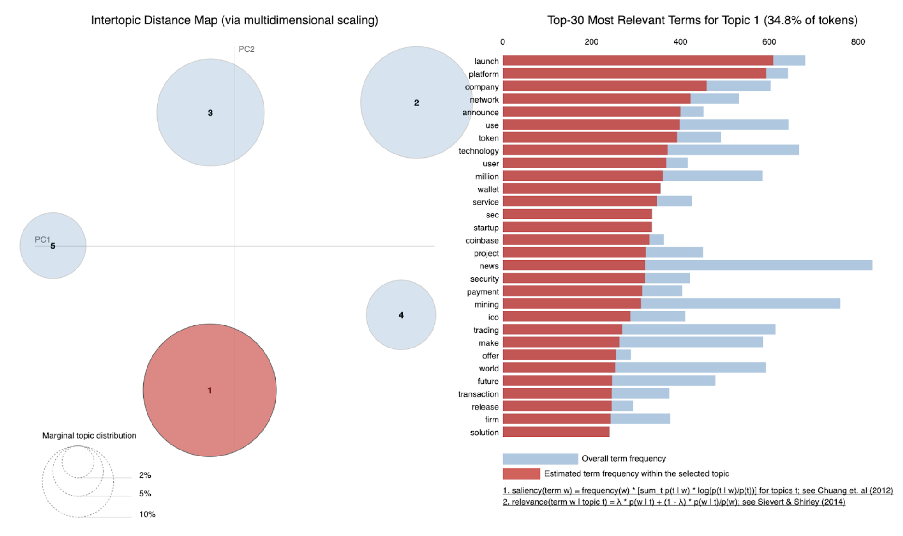

# Bitcoin Sentiment and Topic Analysis Over Time

From an investment perspective, Bitcoin is one of history's best performing financial assets. If you bought just $100 in Bitcoin in early 2011, you would be 2 million dollars richer when bitcoin was at its peak! It only made sense for me to try to predict Bitcoin price direction using machine learning just as its already being done with stocks and other investments.

However, Bitcoin is different from typical investments such as stocks, bonds, and commodities and many of these differences contribute to how people value it and why it has so much volatility.

Unlike other financial assets such as Stocks, Bonds, or Commodities, there are no earnings reports, revenue, cost, or any many of the other traditional financial metrics to track how well an asset is doing. Only the verifiable fixed supply/scarcity and the level of social acceptance and confidence drives price.

**Bitcoin price is driven by two main factors:**

**Verifiable Fixed Supply/Scarcity** -- Programmed Fixed Supplied and Blockchain technology to verify transactions.

**Social Acceptance/Confidence** -- Measured by Sentiment and Topics over time.

## Business Problem/Motivation
Bitcoin's largest gains happen in a very short amount of time. Bitcoin's greatest gains occured in a time window of just a few weeks. Knowing the sentiment and composition of topics being talked about in cryptosphere can help investors position themselves for large positive and negative price movements. 

**I decided to analyze the sentiment and topic composition over time to see if they can be used as reliable indicators of price movement.** 

## Methodology
**1. Data Collection**

I utilized an API that pulls data from various crypto news websites. The data that I gathered included the open and close prices of Bitcoin as well as the article name and text body from news articles from 2016-2018.

**2. Data Cleaning and PreProcessing**

I conducted data preprocessing for natural language processing and sentiment analysis. I lemmatized news article text, cleaned the text, created custom stop words, and then used Tfidfvectorizer to tokenize and vectorize words placing more weight on less common words.

**3. Sentiment Analysis**

I then utilized Textblob and Vader to generate sentiment scores and then averaged the two scores together for a composite score per document. I then charted Bitcoin's % Price Change and the 7 day moving average of sentiment over time. I utilized the 7 day moving average of sentiment because I wanted to capture the average sentiment of the preceding week and its affect on price.

**4.Topic Modeling**

I utilized Non-Negative Matrix Factorization (NMF) and Latent Dirichlet allocation (LDA) to generate topics from the articles. In the process, to improve the topics generated, I adjusted the stopwords and number of components in the model.

**5. Final Model**

I eventually generated 5 meaningful topics and tracked these topics and the BTC price over time to observe patterns.

## Findings

**Sentiment Analysis:**

The chart above shows the 7 day moving average of sentiment along side with percentage change in BTC price. As you can see many times negative movement in sentiment precedes negative percentage change in BTC price. The red circles in the chart highlights these instances. Although promising, as a standalone tool it may not be robust enough to be utilized as a indicator; however, when combined with fundamental and technical analysis it could be very helpful in making an short-term transcation.

**Topic Modeling:**

Utilizing LDA, I was able to generate 5 meaning topics that dynamically on their prevalence changed over time as BTC's price changed.

| Topic Name           | Words                                   | Notes                         |
| ----------------- | --------------------------------------- | ---------------------------- |
| Positive Developments and Technology(FOMO)| launch, platform, company, network, announce, use, technology | Words associated with more legitamacy and hope for BTC |
| Financial News and Regulation| bank, currency, financial, central, digital, regulation, government| Regulatory news regarding current financial systems and government guidance |
| Market Analysis| high, btc, week, drop, low, day, time, gain, rise, bull| Market Analysis and price movement discussion|
| Altcoins| ripple, xrp, litcoin, eos, tron, bch, stellar | Altcoin names |
| National Bans, Scams, 51% Attacks (FUD)| mining, ban, india, court, chinese, scam, bitmain, attack| Words associated with negative news impacting BTC and crypto's legitamacy|

Two important topic stuck out generating the most signal. These are **Technological and Positive Development** and **Negative News/Opposition to Adoption**. These two topics positively and negatively contribute to the legitamacy of Bitcoin and seem to give some insight in price direction and reversals based on their relative compositions of all news being reported.

**Technological and Positive Development**

**Negative News/Opposition to Adoption**

**Topic Composition Overtime**

These charts track BTC closing prices and Topic Composition over time. I focused on two main topics that seemed to generate some signal in regards to BTC price direction. **The Green: Technological and Positive Developments etc (FOMO), The Red: Negative News/Opposition to Adoption (FUD), Orange: BTC Closing Price**.

As you can see, when there is a big divergence between FOMO and FUD where FOMO hits very high levels, and where FUD is at a all time low price tends to peak. When FOMO crossed below FUD in the past it indicated a sever price drop. However, when FUD overtakes FOMO and the two diverge, it appears to indicate a price increase in the horizion.

## Take Aways

In this project, I was able to distinctly find patterns between sentiment, topics, and price. The models and analysis I generated showed that sentiment can be used as a tool to predict short-term BTC price movements and the proportion of topics from news articles text data can indicate the overall climate of the market and be used to predict reversals and longer term price movements. This confirms my original hypothesis that Bitcoin price direction is in part driven by sentiment and the 'conversation' the masses and media is having surronding this volatile investment. I hope to one day develop this into a full fledged trading algorithm along with technical analysis. See you on the moon!

